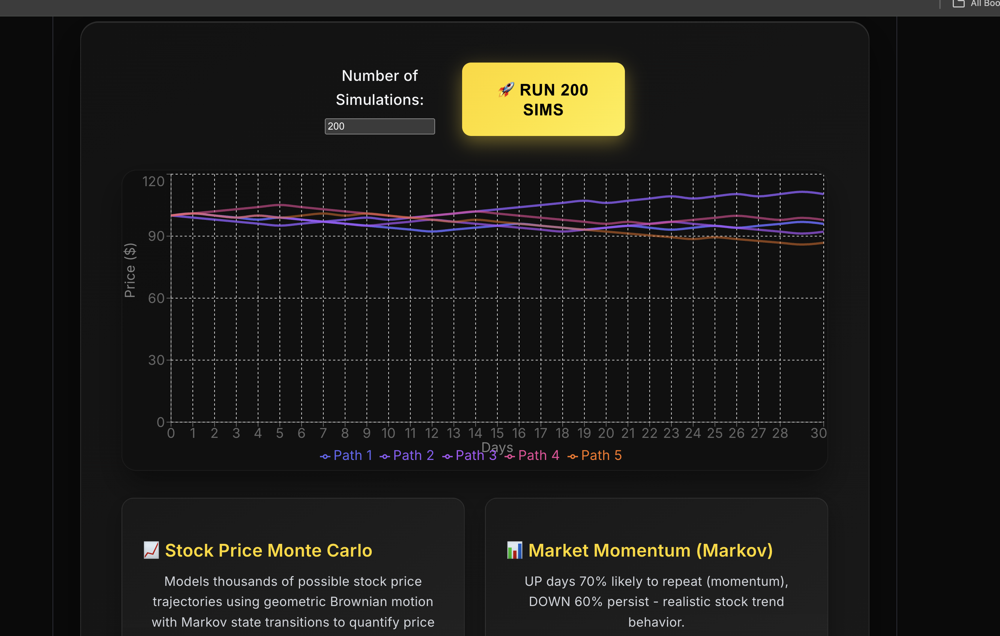

# 📈 Entangled Market Simulator

**HackIndia OpenClaw Hackathon | Team Entangled**

Interactive dashboard using **Markov Chain Monte Carlo (MCMC)** to simulate market paths and visualize uncertainty in predictive markets.

---


## 🎥 Demo Video

This video demonstrates the working of the **Entangled Market Simulator**:

- Running Monte Carlo simulations (200+ paths)
- Backend generating stochastic market paths
- Frontend visualizing top simulation results
- Interactive UI with real-time chart updates

[](./Simulation.mp4)

🔗 **Direct Link:** [Open Video](./Simulation.mp4)

---

## ✨ Features

* ⚡ Run **1000+ Monte Carlo simulations** instantly
* 📊 Visualize **top 10 probable market paths**
* 🔄 Real-time interaction with backend API
* 🎯 Clean UI with smooth transitions & glassmorphism

---

## 🧠 How It Works

We model market movement using a **Markov Chain**:

```
States:
0 → DOWN  
1 → UP  

Transition Matrix:
UP (1)   → 70% UP, 30% DOWN  
DOWN (0) → 40% UP, 60% DOWN  

monte_carlo(1000) → 1000 simulated paths (31 steps each)
```

* **Backend:** `simulation.py` generates stochastic paths
* **Frontend:** `Simulator.jsx` fetches → `Chart.jsx` renders

---

## 📱 UI Flow

```
Hero Section → Run Simulation Button → Loading → Multi-line Chart
```

* X-Axis → Time Steps
* Y-Axis → Market State (0/1)

---

## 🛠 Tech Stack

| Component | Tech                           |
| --------- | ------------------------------ |
| Backend   | Flask, Python                  |
| Frontend  | React, Vite                    |
| Charts    | Recharts                       |
| API Calls | Axios                          |
| Styling   | CSS Modules (Glassmorphism UI) |

---

## 📁 Project Structure

```
.
├── backend/
│   ├── app.py
│   └── simulation.py
├── frontend/
│   ├── src/App.jsx
│   ├── components/
│   │   ├── Simulator.jsx
│   │   └── Chart.jsx
├── Simulation.mp4
├── preview.png
├── README.md
└── TODO.md
```

---

## 🚀 Run Locally

### 1️⃣ Backend

```bash
cd backend
pip3 install flask flask-cors
python3 app.py
```

### 2️⃣ Frontend (new terminal)

```bash
cd frontend
npm install
npm run dev
```

### 3️⃣ Open App

```
http://localhost:5173/
```

👉 Click **Run Simulation** → Chart loads instantly

---

## 🌐 Deployment

| Service          | Usage    |
| ---------------- | -------- |
| Vercel / Netlify | Frontend |
| Render / Railway | Backend  |

---

## 🚀 Future Improvements

* 📈 Real market data integration
* 🧠 Advanced probabilistic models
* 📊 More analytics & charts
* ☁️ Full cloud deployment

---

## 🤝 Team

**HackIndia 2024 | OpenClaw Track**

Built with ❤️ for **predictive markets & probabilistic modeling**
